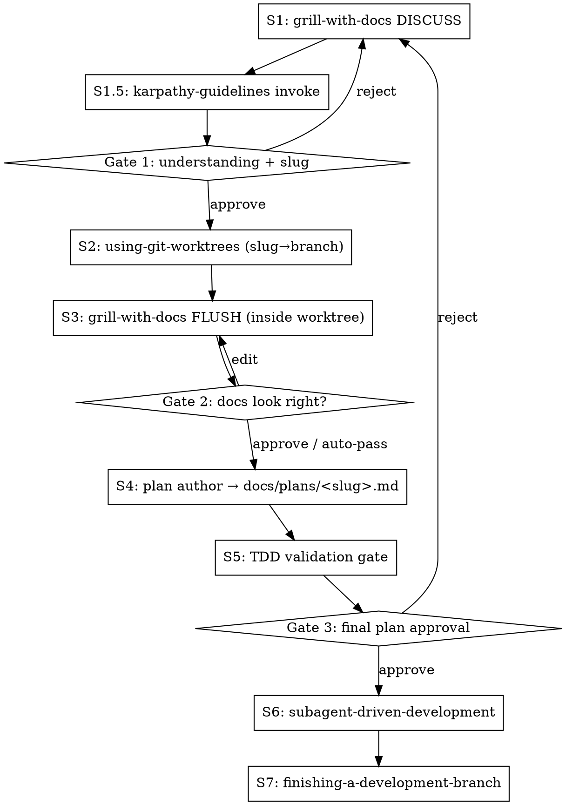

# Doc-Driven Feature Pipeline

Idea → grilling (discuss) → worktree → docs (flush) → plan → TDD gate → execution → PR. Every feature ships with reviewable domain documentation (CONTEXT.md terms + ADRs) in the same branch.

No external LLM cross-check. No `gemini-cli` dependency. The grilling phase produces durable domain docs instead of just a clarification log.

## ⚠️ Start immediately: register pipeline state

**Always register 8 steps via TaskCreate first.** Long grilling conversations cause step amnesia. The S1 todo title carries the slug once decided.

```
1. [S1]   grill-with-docs DISCUSS — Q&A only, no file writes (slug=tbd)
2. [S1.5] karpathy-guidelines invoke
3. [S2]   using-git-worktrees — isolated workspace
4. [S3]   grill-with-docs FLUSH — write CONTEXT.md + ADRs inside worktree
5. [S4]   plan author — docs/plans/<slug>.md
6. [S5]   TDD validation gate
7. [S6]   subagent-driven-development
8. [S7]   finishing-a-development-branch
```

## Input mode detection

| Input shape | Mode | grill-with-docs DISCUSS behavior |
|-------------|------|----------------------------------|
| Short single sentence | Idea | Mine requirements from scratch |
| Paragraph / structured text | Refinement | Probe only gaps, contradictions, and unstated assumptions |

## 7-step pipeline



## Gates: user approval procedure

At each gate, **do NOT mark the next-step todo `in_progress` until the user response arrives.**

| Gate | Position | Required action |
|------|----------|-----------------|
| Gate 1 | After S1.5 | `AskUserQuestion`: confirm understanding + slug (+ context target if `CONTEXT-MAP.md` exists) |
| Gate 2 | After S3 | `AskUserQuestion`: review CONTEXT.md diff + ADR titles; approve / edit / drop. Auto-pass if 0 ADRs and <3 new terms. |
| Gate 3 | After S5 | `AskUserQuestion` for final plan approval. **Never use `ExitPlanMode`** — triggers `plan_file_reference` reattach explosion. |

---

## S1: grill-with-docs DISCUSS MODE

Invoke `grill-with-docs` via the Skill tool, but **override its inline-write directive** for this phase.

`grill-with-docs/SKILL.md` says: *"Update CONTEXT.md inline … Don't batch these up — capture them as they happen."* This pipeline overrides that line for S1 only. Reason: **CONTEXT.md and ADRs must be feature-branch artifacts, reviewable in the PR. Writing them at main-repo root before isolation exists would scatter feature work across branches.**

**S1 directive (paste into the grill-with-docs invocation):**

> Run the grilling per `grill-with-docs`, but **DEFER all file writes**. Do NOT use Write or Edit tools during this phase. Maintain an in-memory "decisions ledger":
> - **Terms ledger**: `<term> → <definition>` (every resolved domain term)
> - **Decisions ledger**: `<decision> → <rationale> + <alternatives considered>` (every crystallised design choice)
>
> Continue grilling — challenge against the existing `CONTEXT.md` glossary, sharpen fuzzy language, cross-reference with code — but record everything in conversation. The ledger will be flushed to disk in S3 once the worktree is created.

At S1 close:

1. **Derive a slug** from the topic (kebab-case, 2–4 words). Surface as `Proposed slug: <kebab>`.
2. **Update the S1 todo title** with the slug (e.g., `[S1] grill-with-docs DISCUSS (slug=order-cancellation)`).
3. **Check for `CONTEXT-MAP.md`** at repo root via `mcp__serena__find_file`. If it exists, determine which context (subdirectory) this feature belongs to — needed for S3 path resolution.

## S1.5: karpathy-guidelines invoke [carries from feature-pipeline ADR-0013]

Immediately after S1, before Gate 1:

```
Skill tool → andrej-karpathy-skills:karpathy-guidelines
```

**If invocation fails**: print a warning and continue. The inline 4-principle summary at the bottom of this file is the fallback — invoke failure is not a pipeline halt.

**Purpose**: load the 4 principles into context so S4 (plan), S5 (TDD gate), and S6 (subagent execution) all run with them resident.

---

## Gate 1: AskUserQuestion — understanding + slug

Single `AskUserQuestion` call with these confirmations:

- **Understanding**: requirements captured correctly? Any term you'd phrase differently?
- **Slug**: accept `<proposed-slug>` / rename to `<custom>` / regenerate?
- **Context target** (only if `CONTEXT-MAP.md` exists): which context owns this feature?

On reject → loop back to S1, continuing the grilling from where it stopped.

---

## S2: using-git-worktrees (slug → branch)

Invoke `superpowers:using-git-worktrees` via the Skill tool with branch name:
- `feat/<slug>` for new functionality
- `fix/<slug>` if S1 grilling identified the work as a bug fix

After invocation, verify isolation:

```bash
git rev-parse --git-dir && git rev-parse --git-common-dir
```

If the two paths are **equal** (= main repo), STOP — re-enter the worktree before proceeding. Different paths = inside a worktree, proceed to S3.

---

## S3: grill-with-docs FLUSH MODE

Now inside the worktree, flush the S1 ledger to disk. This is the half of `grill-with-docs` that was deferred.

### CONTEXT.md updates

- **Locate the target file**: project root `CONTEXT.md` by default, or the subdirectory identified via `CONTEXT-MAP.md` in Gate 1.
- **Read the existing file first**. Never silently overwrite canonical terms. For each term in the S1 ledger:
  - If the term already exists with a compatible definition: skip.
  - If the term already exists with a conflicting definition: do NOT auto-replace. Flag it in the Gate 2 prompt for the user to resolve.
  - If the term is new: append to `CONTEXT.md` per the format in `/home/kshull/.claude/skills/grill-with-docs/CONTEXT-FORMAT.md`.
- **Create `CONTEXT.md` lazily** if it doesn't exist yet — only when the first term is being written.

### ADRs

Emit `docs/adr/NNNN-<slug>-<topic>.md` files only for decisions in the S1 ledger that meet **all three** criteria (per `/home/kshull/.claude/skills/grill-with-docs/SKILL.md` lines 60–65):

1. **Hard to reverse** — cost of changing your mind later is meaningful.
2. **Surprising without context** — a future reader would wonder "why did they do it this way?"
3. **Result of a real trade-off** — there were genuine alternatives and you picked one for specific reasons.

If any of the three is missing, the decision belongs in `CONTEXT.md` or stays as a task note in S4 — not an ADR. Format per `/home/kshull/.claude/skills/grill-with-docs/ADR-FORMAT.md`. Number ADRs sequentially based on existing `docs/adr/` entries.

### Plan/ADR separation rule

After S3, the plan in S4 references each ADR by ID only (e.g., `See ADR-0007 for the cancellation-window rationale`). **Never restate ADR rationale in the plan file** — that bloats the plan past its 8KB budget (see ADR-0016 in the parent feature-pipeline).

## Gate 2: AskUserQuestion — docs look right?

Show the user:
- Diff applied to `CONTEXT.md` (new/modified terms)
- Titles of any new ADRs

Options:
- **Approve** → proceed to S4
- **Edit term N** → return to S3 with the correction
- **Drop ADR N** → remove the ADR file and reduce numbering as needed
- **Resolve conflicting term** → present each conflict; user picks "keep existing", "replace", or "rename new term"

**Auto-pass shortcut**: if S3 produced 0 ADRs AND fewer than 3 new `CONTEXT.md` terms AND no conflicts, skip the prompt and print a one-line summary (e.g., `Gate 2 auto-passed — 1 new term, 0 ADRs.`). Keeps small features fast.

---

## S4: Plan file authored directly

Write the plan to `$(pwd)/docs/plans/<slug>.md` (absolute path inside the worktree). Do NOT invoke `superpowers:writing-plans` — write the file directly, same approach as the parent feature-pipeline (ADR-0015 lineage).

**Path conflict**: if `docs/plans/<slug>.md` already exists, ask the user: continue editing / new slug / abort.

### Plan slim-down rule

The plan holds **header + tasks + (optional) post-execution summary only**. Target: **≤ 8KB**.

- Do not paste the S1 grilling conversation into the plan — summarise each decision and rationale in 1–2 sentences with an ADR reference where applicable.
- If the plan exceeds 8KB, trim non-essential explanation and remove context narrative outside task bodies.

**Why**: Claude Code's plan mode reattaches the entire plan file to context every turn. A bloated plan nullifies compression instantly and destroys long sessions.

### Plan header (required)

```markdown
# <Feature Name> Implementation Plan

**Goal:** <one sentence — what this plan implements>
**Architecture:** <2–3 sentences — approach>
**Tech Stack:** <core libraries/tech>
**Related ADRs:** ADR-NNNN, ADR-NNNN
**Related Terms:** see CONTEXT.md sections X, Y
```

### Task structure

```markdown
### Task N [TDD]: <description>

**Files:**
- Create: `path/to/new/file.ext`
- Modify: `path/to/existing/file.ext`
- Test: `tests/path/to/test.ext`

- [ ] Step 1: …
- [ ] Step 2: …
```

### Section structure

Header → **Tidying Phase** → **Behavioral Phase**:

```markdown
## Tidying Phase

### Task N [TIDY]: <structural cleanup description>
…

## Behavioral Phase

### Task N [TDD]: <feature description>
…

### Task N [TDD-EXEMPT: pure config, no logic]: <config change>
…
```

### Simplicity-First guardrail (Karpathy §2)

For each task, check:
- Does the task include anything beyond what was requested?
- Are there unnecessary abstractions in single-use code?
- Is there pre-written "flexibility/extensibility" code?

"Can the 200-line version be done in 50?" — If yes, narrow the task.

### Task label rules

| Tag | Applies to | S6 execution behavior |
|-----|------------|----------------------|
| `[TIDY]` | Pure structural changes | `dev:tidy` activated, `[PHASE: STRUCTURAL]` enforced |
| `[TDD]` | All behavioral tasks (default) | `superpowers:test-driven-development` enforced |
| `[TDD-EXEMPT: <reason>]` | CRUD/DTO/config/migration only | Regression test after implementation |

---

## S5: TDD validation gate

Run and quote the result in your response:

```bash
grep -E '^### Task .+\[(TDD-EXEMPT[^]]*|TDD|TIDY)\]' "$(pwd)/docs/plans/<slug>.md"
```

From the quoted result, check (structural-only, no content semantics):

1. Does every behavioral task carry `[TDD]` or `[TDD-EXEMPT: <reason>]`?
2. Do `[TDD]` tasks include Test → Run-fails → Implement → Pass substeps structurally?
3. Are `[TIDY]` tasks isolated to the Tidying Phase section (not mixed into Behavioral Phase)?
4. Does every task have a verifiable success criterion? (Substantive consistency is S6's job.)

**On failure**: do NOT auto-regenerate. Surface the missing evidence (file line numbers) and escalate to Gate 3 for the user to direct the fix.

> Karpathy §4 (goal-driven execution) enforcement at runtime is S6's responsibility. S5 only verifies structural readiness.

---

## Gate 3: AskUserQuestion — final plan approval

`AskUserQuestion` with the plan path and a summary of task counts. Approve / request edits / reject.

**Never use `ExitPlanMode` here.** ExitPlanMode = entering plan mode = `plan_file_reference` reattached every turn = compression explosion. AskUserQuestion only.

On reject → loop back to S1 (grilling restart) only if the rejection reveals the requirements were wrong. If the rejection is about plan structure, return to S4 instead.

---

## S6: subagent-driven-development

Invoke `superpowers:subagent-driven-development`. In each implementer prompt, include:

- `[TIDY]` task → activate `dev:tidy` skill, enforce `[PHASE: STRUCTURAL]`
- `[TDD]` task → enforce `superpowers:test-driven-development`
- Pass the plan file path as an **absolute path**

**[Karpathy 4-principle subagent guardrail]** — **§2 and §4 are 100% dependent on the text below being pasted verbatim into the subagent instructions.** (Parent feature-pipeline ADR-0017.) Paste all three principles into every implementer prompt:

- **§2 Simplicity First**: No features, abstractions, or "flexibility" code beyond what was requested. If it looks like 200 lines, re-explore the 50-line possibility. (Enforced 100% in S6.)
- **§3 Surgical Changes**: Every changed line must be directly traceable to the user's request. No "improvements" to adjacent code, no requested-adjacent refactors, no unrelated dead-code removal.
- **§4 Goal-Driven Execution**: Completion judged only by the task's stated verification criteria. "Works on my machine" is not done. If the criteria are ambiguous, report BLOCKED. (Enforced 100% in S6.)

---

## S7: finishing-a-development-branch

Invoke `superpowers:finishing-a-development-branch`. Optionally chain to `git:clean` for the full PR workflow.

**PR body must reference**:
- New ADRs created in S3 (titles + IDs)
- CONTEXT.md changes (a one-line description)
- Link to `docs/plans/<slug>.md` (if not `.gitignore`d)

Reviewers should see the doc artifacts surfaced explicitly, not buried in the diff.

---

## Skip conditions — none

This pipeline has no self-skip conditions. The following are NOT permitted:

- ❌ "Urgent, skip the worktree" — without isolation, S3 docs land at main and S6 plan paths drift.
- ❌ "Bug fix, skip grilling" — bug fixes still need scope and reproduction conditions captured.
- ❌ "Small feature, skip the docs phase" — use the Gate 2 auto-pass instead. The phase still runs; it just stays terse.
- ❌ "Small change, skip TDD gate" — missing tags = no TDD enforcement at execution time.
- ❌ "User said to skip step X" — user requests do not override pipeline structure. Explain and proceed.

If the user wants partial execution, they should invoke individual skills directly (`grill-with-docs`, `superpowers:using-git-worktrees`, etc.) instead of this pipeline.

---

## Red signals — STOP

| Thought | What it really means |
|---------|----------------------|
| "I'll write CONTEXT.md during S1" | S1 is discuss-only. Writes happen in S3 inside the worktree — otherwise docs land on main and pollute it. |
| "Every decision deserves an ADR" | ADRs need all 3 criteria (hard-to-reverse + surprising + real trade-off). Most decisions are just CONTEXT.md terms or task notes. |
| "I'll write the plan first and worktree later" | Path mismatch — S6 subagents read from a different worktree than where the plan lives. S2 before S4 always. |
| "I'll skip the TDD gate" | Missing tags = no TDD at execution time. The gate is structural-only and cheap — run it. |
| "Right after grilling, straight to code" | Skips worktree, plan, docs. After S1 comes S1.5, then S2. |
| "Tracking steps in prose is enough" | Long conversations cause step amnesia. TaskCreate is mandatory. |
| "It's a bug fix, so the pipeline rules can be relaxed" | `/workflow` invocation = full pipeline. No bug-vs-feature exception. |
| "User said no worktree" | Pipeline structure is not user-overridable. Explain and proceed to S2. |
| "Karpathy invoke failed, so principles don't apply" | The inline 4-principle summary below is the fallback. Invoke failure ≠ pipeline halt. |
| "I'll fill in success criteria later" | S5 will block. Write them now. |
| "I'll clean adjacent code while I'm here" | Out-of-scope changes violate Surgical Changes. Split into a separate `[TIDY]` task or skip. |
| "Paste the entire grilling conversation into the plan" | The plan reattaches every turn. 30–98KB plans destroy sessions. Decisions + tasks + ADR references only. |
| "Use ExitPlanMode for Gate 3 approval" | ExitPlanMode = plan mode = constant `plan_file_reference` reattach. Gate 3 uses AskUserQuestion only. |
| "Subagent guardrails — §3 alone is enough" | Without §2 and §4 pasted, subagents over-engineer and judge completion by vibes. Paste all three. |
| "CONTEXT.md conflict — just overwrite the old definition" | Conflicting terms must surface at Gate 2 for user resolution. Silent overwrites corrupt the glossary. |

---

## Karpathy 4 principles — inline summary [fallback]

Used if `andrej-karpathy-skills:karpathy-guidelines` is not installed and S1.5 invoke fails.

| Principle | One-line rule | Active at |
|-----------|---------------|-----------|
| §1 Think Before Coding | State assumptions explicitly; surface confusion as questions, not silence. | S1 grilling |
| §2 Simplicity First | Only what was requested, in the minimum code. No speculative abstractions. | S6 subagent execution (100% dependency) |
| §3 Surgical Changes | Every changed line traces directly to the user's request. | S6 execution (100% dependency) |
| §4 Goal-Driven Execution | Success criteria must be verifiable. "Make it work" is not a criterion. | S6 subagent execution (100% dependency) |
